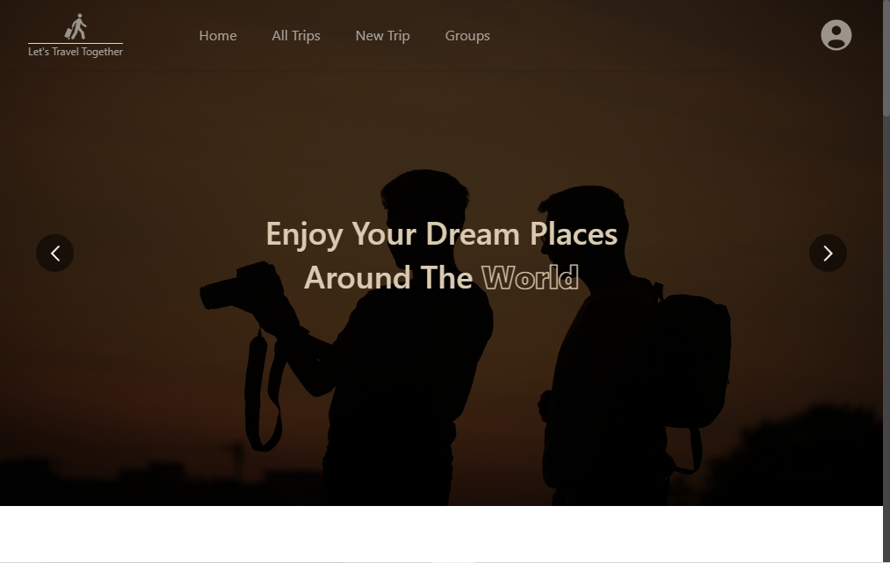
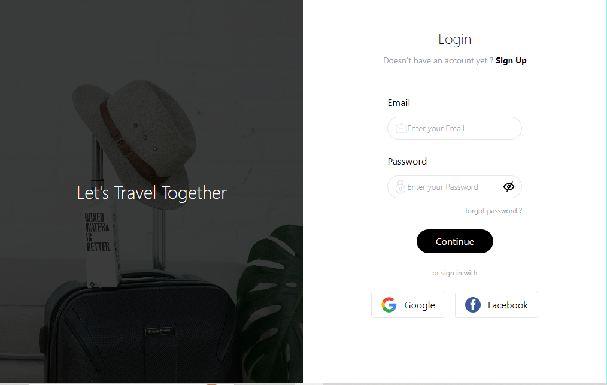
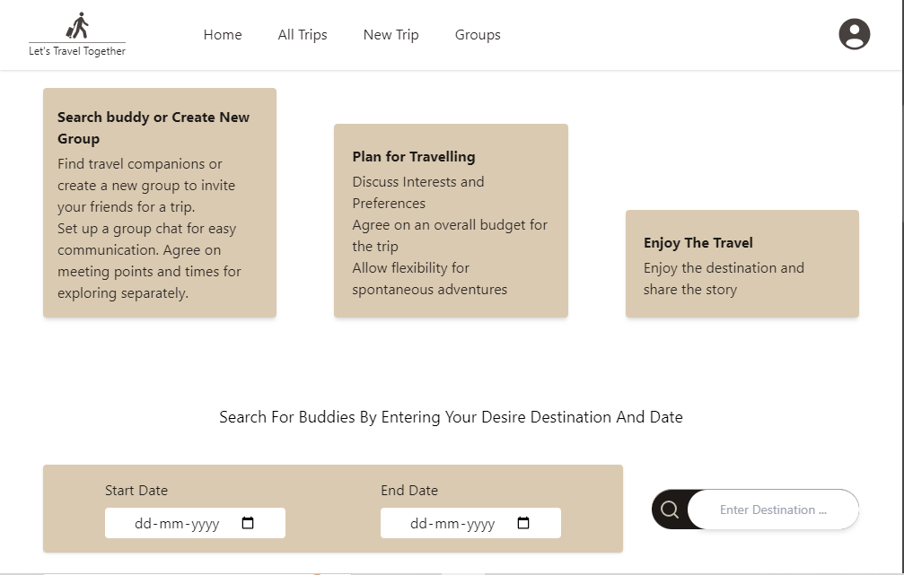
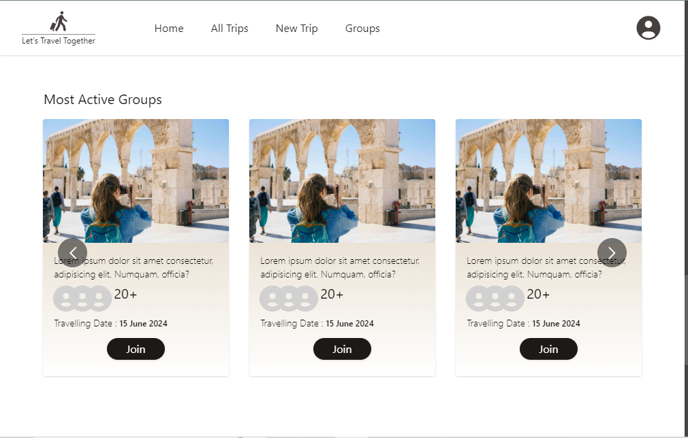
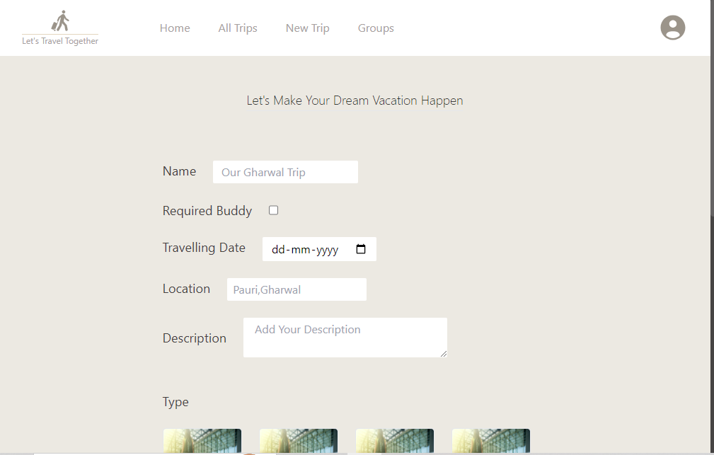
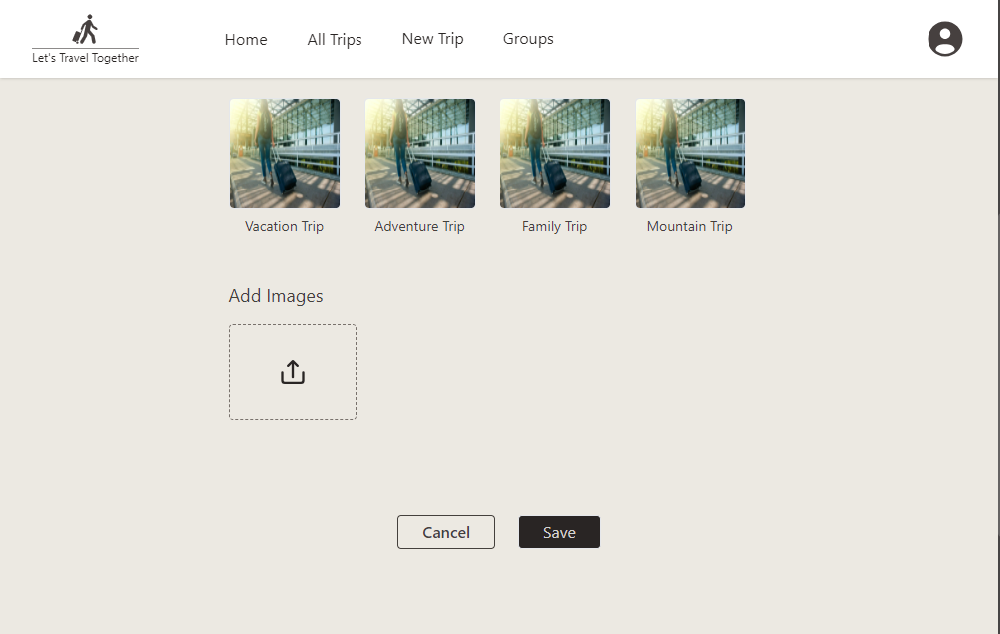
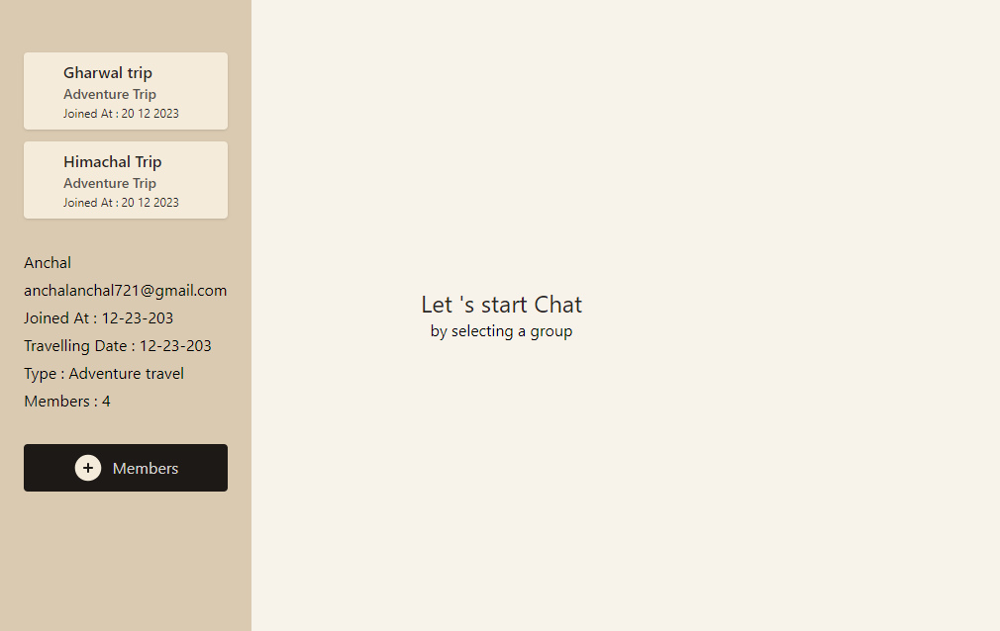
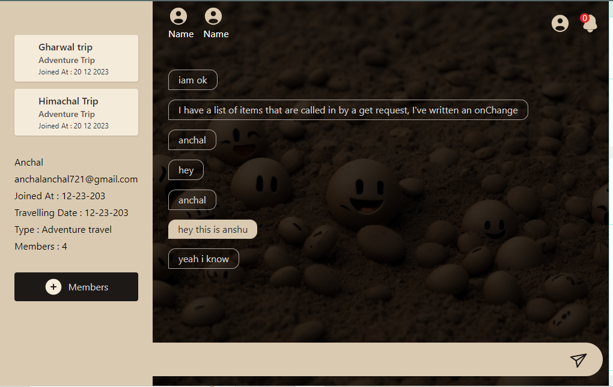

# Trip_Buddy

It allow users to search online for travel companions for their desired destination. User can create new travel group and invite friends.

## Features

- **Personalized Trip Planner**
- **Budget Tracker**
- **Trip Sharing**
- **Real-Time Updates**



## Technologies Used

- **Frontend**: React.js
- **Backend**: Node.js
- **Database**: MongoDB

## Screenshots

Here’s a look at the app interface:

<div style="overflow-x: auto; white-space: nowrap;">
  
  
  
  
  
  
  
</div>

## Installation

To get started with Trip_Buddy, follow the steps below:

1. Clone the repository:
   ```bash
   git clone https://github.com/yourusername/trip_buddy.git
